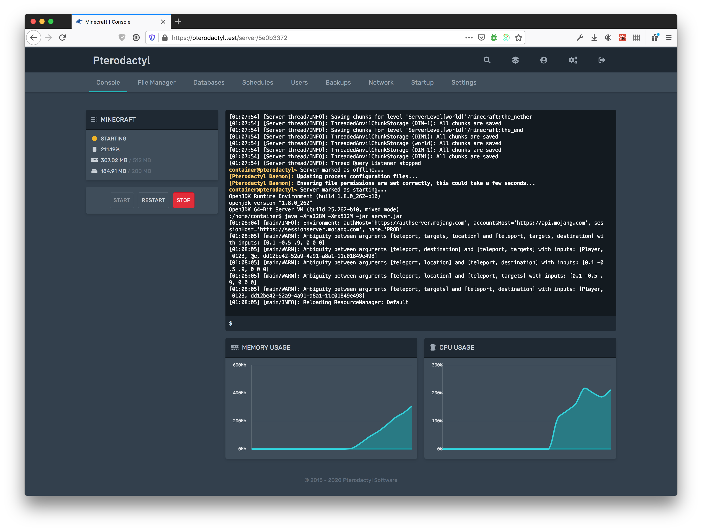
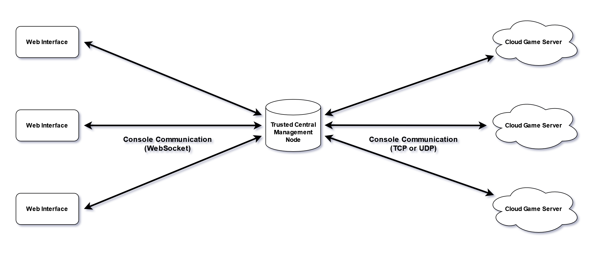
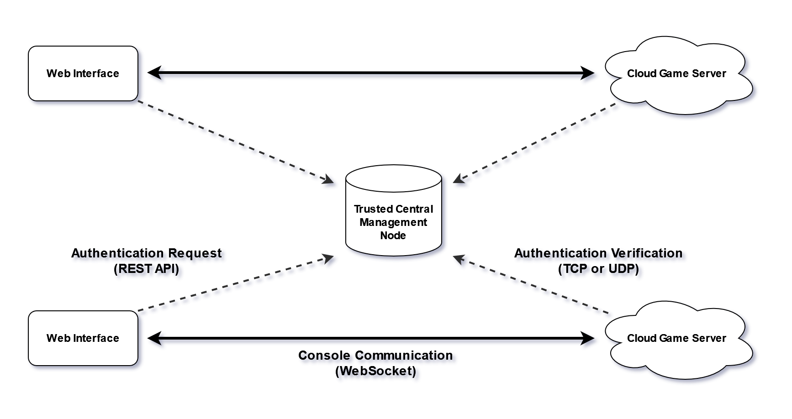
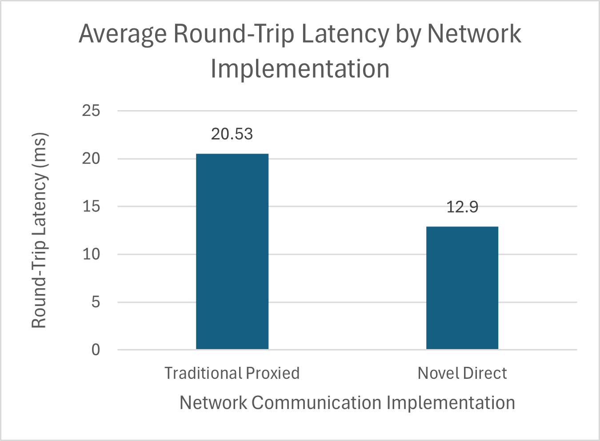
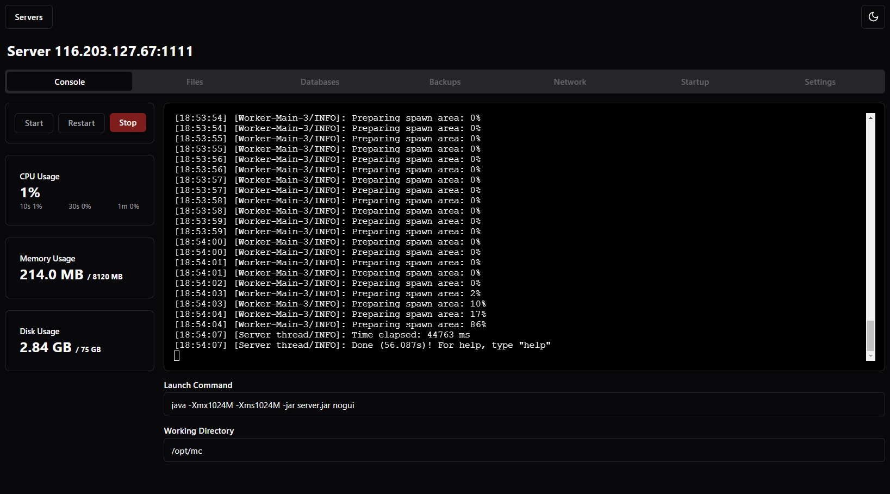
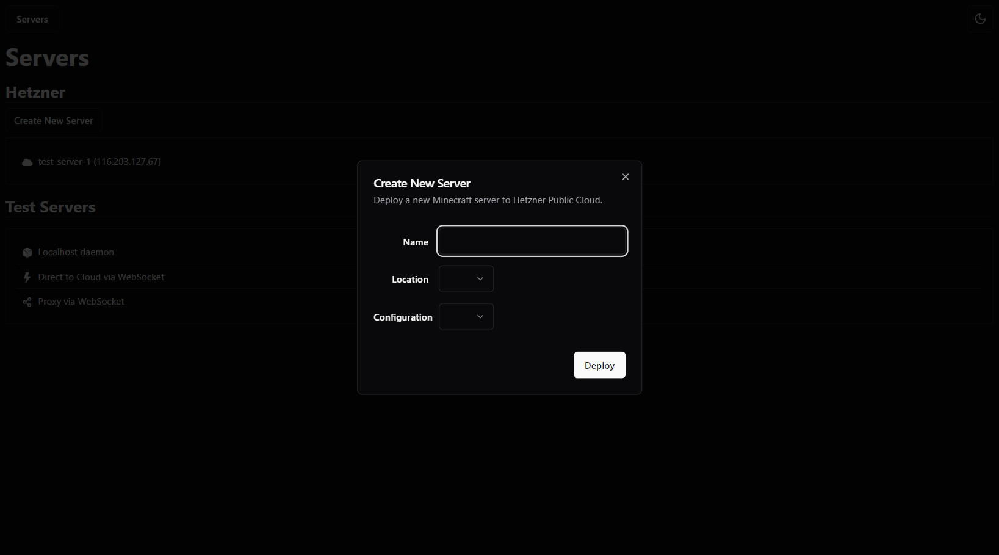

\pagebreak

# Links

- Video Presentation & Demo: <https://youtu.be/UCJVvevLONo>
- GitHub Repository: <https://github.com/noahc3/cumulus-comp4300>

# Vision

## Description

The goal of this project is to develop the core technical components necessary to facilitate creating a 
specialized server hosting platform optimized for hosting multiplayer game servers for games like Minecraft, 
Grand Theft Auto, ARK Survival Evolved, and more. This project focuses on parts of the user-interface of 
managing a server running a game, and implementing the communications between the user-facing web control panel
and the server running the game process. The novelty of this project is it's focus on integration with
public cloud services for game hosting, rather than using dedicated 'node' servers which run potentially
dozens of servers for multiple clients.

## Motivation and Prior Work

In some sense, this is a solved issue. There are plenty of game control panels with expansive feature sets
available as free open-source software, such as Pterodacyl and PufferPanel, among others. However, 
this project aims to create components for a panel which aims to support a novel usage.

Traditionally, game server hosting businesses rent or own powerful dedicated servers with dedicated hardware, and
then use features provided by control panels to divide the resources on those dedicated servers across multiple
customers. This approach allows some reduction of resource overhead, as since multiple instances of a game server 
run on a single machine, the operating system runtime is shared. This approach also ensure that hardware is dedicated 
exclusively to the sole purpose of running game servers, improving cache performance and ensuring resources are
not being consumed for other purposes.

There are caveats to this approach however. Renting dedicated servers or purchasing hardware outright brings a
significant upfront cost to new businesses. This format of operating full server nodes also means that while lots
of hardware is guaranteed to be available, this hardware is consolidated into only a handful of physical 
locations, leading to increased latency between client and server when no hardware is available in datacenters 
located close to users. Leasing dedicated hardware also brings on considerable risk, as a business needs to 
ensure they sell a minimum amount of server resources per month to be profitable, as otherwise they risk having 
underutilized hardware sitting without generating enough revenue to cover the cost of leasing.

To tackle this issue, this project aims to enable support for deploying and managing game servers on 
cloud hosting platforms. Cloud hosting providers like Google Compute Engine, Amazon Web Services, and 
Hetzner Public Cloud, amongst others, offer highly customizable hardware leasing options with hourly billing,
packaged in the form of easily deployable virtual machines in the cloud. By deploying these smaller virtual 
machines on-demand, rather than leasing full racks of baremetal hardware ahead of time, businesses can ensure 
they are never operating at a loss no matter how many customers they currently have by simply pricing their unit 
offerings to cover the full monthly cost, and only deploying servers when customers are still actively paying 
for them. This approach also brings benefits to customers as well; for example, hourly billing enables a server
hosting business to offer hourly billing themselves, or alternatively, pro-rated refunds, at no cost to 
themselves since cloud services are priced per-hour. A dynamic backup system could also be implemented to allow
customers to "pause" their subscription; the hosting provider can simply move the game server data to cheap
cold storage, and delete the cloud server instance until the customer is ready to resume their service.

While it's possible to run other solutions like Pterodactyl or PufferPanel with the cloud server format
described above, it is not optimal to do so. These solutions operate around the concept of "server nodes" where
each physical server is expected to host several game server instances at once. This ultimately means the design 
considerations of these other solutions are different; they assume some non-trivial amount of memory and 
processing is available on the host to use as overhead for the node management daemon. This aspect also leads to
both technical and user-experience design decisions that revolve around the concept of larger server nodes, 
rather than many smaller cloud deployments.

The focus for this project, then, is to develop some of the core technologies required to create a game server 
hosting platform, with a focus on developing solutions which use as few computing resources as possible on the 
game servers themselves, and optimizing network design to have robust support for managing and communicating 
with potentially hundreds or thousands of distinct cloud servers with low latency and a good user experience.

## Core Features

The primary focus of this project will be developing the technology to manage and communicate with many cloud
servers at once. This largely will consist of two components: the daemon which is installed on remote cloud
servers to monitor, and the web control panel which is able to manage and communicate with these daemons.

### Web Control Panel

The photo below shows the layout of the console view provided by Pterodactyl panel. 



This interface includes the standard output and standard error of the running game server process, and provides 
a text field for entering into standard input. Some basic graphs are also shown for memory and CPU utilization, 
alongside disk usage, server status, and buttons to start, restart, or stop the server. Replicating the features
of this particular page is the core focus of the user-interface portion of this project. More simply put, we 
plan to develop a webpage to manage servers with the following features:

- Ability to view all servers available to the given user
- Ability to automatically deploy new servers within the web interface
- Ability to monitor console log output of the server process
- Ability to monitor resource utilization of memory, disk, and CPU
- Ability to start, restart, or stop the server

When implementing these features, we want to focus on performance, reliability, and user-experience. This means
we would also like to ensure the following functionality:

- Have standard input be integrated into the terminal output view, like a typical SSH or TTY client
- Ensure user can scroll up through the console history, including viewing output recorded before the web page was loaded
- Detailed resource utilization information, including high frequency of updates

Obviously much more work would be needed to create a full server hosting platform, however this functionality
gives everything that is required to test the functionality of the daemon component.

### Server Daemon

The server daemon is certainly the more technically involved piece of this project. We need to create an
executable that can do all of the following reliably:

- Launch a process with commandline arguments configured in the control panel
- Stream standard output and standard error over the network to be viewable in a web page
- Stream standard input from a web page back to the running process
- Support handling signals for starting, restarting, or stopping the server process
- Reliably handle process crashes, including steaming standard error to the console view
- Consume as few server resources as possible

All of this sounds simple in theory, in fact, SSH has had this all solved for decades. The tricky part is
that it all needs to be usable from a web interface. This brings considerable challenges to the frontend
design (typically web frameworks perform quite poorly making frequent DOM changes based on streamed data),
and we are limited to HTTP-based protocols that the web client can use to feed data into the webpage. This opens
up two potential approaches to the problem; do we want to stream data directly between the web interface and
the cloud game server, with the daemon hosting a minimal HTTP server, or should we instead have some central
server node for data to be proxied through? The initial phase of this project will be to develop test server
applications implementing these approaches, and then conduct benchmarks to determine the most efficient solution
to move forward with for the final product.

\pagebreak

# Exploration of Approaches

As explained above, there are two primary approaches to consider for streaming data between the cloud game server
and the web interface.

## Traditional Proxy Approach

The first possible approach closely resembles the typical approach used by game control panels. One server node
is assigned as the "primary" node, and facilitates all user connections. Then, all other secondary nodes
connect to this node and have the server console proxied through the primary node to the web interface. With
our cloud-based implementation, the only difference from this traditional approach is that our "secondary nodes"
are instead the cloud virtual machine servers themselves, each hosting only one single game server.



In this implementation, each instance of the web interface communicates with the central node over a 
WebSocket - a full-duplex pseudo-socket built on top of standard HTTP, meaning it works perfectly well in the 
browser. Then, the central node connects to each cloud game server over a standard TCP or UDP socket. With this
network design, the primary node acts as a proxy between the cloud game server communicating over a standard
socket, and the web interface which must use a WebSocket.

There are some pros to this design. For one, the authentication scheme is simple. The cental node can simply
reuse whatever authentication protocol it already uses to log each user into the web control panel in the first
place. The daemon running on the cloud servers do not need any special authentication considerations given that
it only needs to authenticate a single host. Therefore, all it needs is the IP address and port of the trusted 
node to connect to, and perhaps some method of verifying the authenticity of the trusted node and encrypting 
communications using a certificate. At no point does the daemon need to know about which users should have
access, or even which user is connecting at all.

Another benefit is that the cloud game server can remain connected to the central management node at all times.
This makes it trivial to implement server status monitoring, as you can simply monitor the connection state
of the socket connection in the case of TCP, or in the case of UDP, periodically send a keep-alive message
to ensure the server is still operating correctly. This also allows the primary node to continuously track
historical resource utilization in a central database as the daemon can periodically push this data over
the existing socket connection.

The downside of this approach is quite obvious: it is not easy to scale, and presents a single point of failure
for the entire business. The single primary node must have the network bandwidth, network stability, and 
processing speed to handle connecting to every single cloud game server instance, and every single web interface 
instance, all simultaneously. While this is certainly not a concern for only a dozen deployments, scaling up to 
potentially thousands or tens-of-thousands of deployments will face resource consumption limitations, and if TCP 
is used, could face exhaustion of available ports on the network interface for holding open connections. Solving 
this would involve load balancing over multiple primary nodes, which while possible, requires more development
time and additional infrastructure design, along with potential concerns over database consistency between nodes.
And if that primary node were to ever go down, perhaps due to datacenter maintenance or an emergency such as
the fire which destroyed one of OVH's Montreal datacenters in 2022, not a single cloud server would be accessible
regardless of where they are hosted.

Another downside is communication latency between the web interface and the cloud game server. Picture a scenario
where a user in Germany wants to deploy a game server in Germany, but the American business has their 
primary node hosted in the United States. Now, all communication must travel from Germany to the United States, 
then back to Germany, just for data to reach the cloud server in one direction! The same hops must then be
taken to return data from the cloud server to the web interface on the return trip. This all feels like pointless 
extra steps that could be eliminated if communication were to occur between the web interface and cloud game 
server directly.

## Novel Direct-to-Cloud Approach

Given the concerns of having a single point-of-failure node in the previous approach, what happens if we choose
to eliminate proxying communication through a central node altogether?



In this implementation, the web interface running in the user's web browser opens a direct WebSocket connection
to the cloud server they are trying to access, allowing direct communication with no middle hop. In this scenario,
the only purpose of the primary node in this scenario is to allow the daemon to authenticate the connecting client.

This approach clearly resolves the concerns of having a single primary node. In the prior example of a German user
connecting to a German server, there is no middle hop to pass through in the United States before reaching the
cloud server, with the connection now staying entirely within Germany. This also resolves the complexity
of load-balancing the primary node, as the only remaining purpose of the central node is to handle authenticating
the user trying to connect to a cloud server. With this implementation, this authentication doesn't need to be 
hosted on a central node at all; it could instead be deployed as an edge function hosted in multiple locations 
using a service like AWS Lambda or CloudFlare Workers. This means that even if there is a data center issue in 
one part of the world, users will simply be redirected to another available deployment of the edge function for 
authentication.

This approach does bring somewhat increased authentication complexity for the daemon software. Since the
user wants to communicate with the cloud server directly, the cloud server needs to be able to know which
users should have access and identify whether the connecting user is authorized to connect. A simple solution
would be to expand the edge function model described above to allow an authenticated user to generate
a temporary authentication token. The web client then passes this token to the cloud server, and the cloud
server can verify the authenticity of the token either by making one network request to the authentication function
to verify the token, or by having the central node sign the token initially with some expiry information built-in
(similar to a JWT token). In either case, communication to a central node is reduced to only one or two requests
for authentication, rather than having every single line of console output passing through the central node.

A bigger downside is that the daemon is now responsible for handling any serverside functionality the web
interface requires, rather than being able to push those requirements off to the primary node. For example,
the daemon now needs to be able to track a certain amount of its output history so it can push the history
to the web interface each time a fresh connection is started. It also needs to be able to handle receiving and
pushing data over multiple connections at once, as its possible multiple administrators could try to interact
with the server console simultaneously. These requirements among potential others means the resource footprint
of the daemon software increases somewhat to handle this increased complexity in functionality.

## Evaluation of Approaches

While you could argue in favor of either of the above network layouts, we want to directly evaluate them
by creating sample implementations of each approach and benchmarking the latency of each.

For our implementations, we created a web interface written in TypeScript using React, Vite and Bun, which is a
newer but still relatively reliable frontend software stack. For the daemon and central node, we chose to write 
the implementations using Go. Go offers a very low resource footprint akin to languages like C, C++ and Rust as
it does not need any heavy runtime installed like C# or TypeScript requires, while also offering unique features 
specifically catered toward creating backend software with concurrency requirements.

After creating prototype implementations of each network topology, we developed test clients (in Go) to send
data over the connection and calculate the round-trip latency. Note that we decided to only test TCP connections, not UDP,
between the cloud and proxy node as we determined minimizing packet loss was critical to this application. We 
took the average of 1000 round-trip messages to calculate the following results:



As we can see, the direct WebSocket approach performs significantly better than the TCP proxy approach - nearly 
8ms faster round-trip time on average. Given the results of this test, we decided to move forward with the 
direct WebSocket approach for the final implementation of our application.

# Final Implementation

For our web frontend, we built off of the same test interface we used when developing our sample server
implementations, sticking with TypeScript and React, Vite and Bun. We used the 'shadcn/ui' UI component kit
along with TailwindCSS to develop a clean, user-friendly interface. For displaying console output and reading
user input, we used Xterm.js along with the Xterm-React wrapper, which provides a React-compatible terminal
element with a simple API for reading and writing to the terminal output, including full support for typical
terminal special characters like ANSI codes. With all of these tools combined, we were able to create a clean
and fully functional interface which can communicate with our daemon software directly.



On the serverside, we again stuck with Go and built out the necessary functionality for starting processes,
monitoring the terminal output, piping in terminal input, as well as sending diagnostic resource usage data
to the frontend by calling the `mpstat`, `vmstat`, and `df` commands within our Go code. Go provides a very
simple interface for launching and interacting with processes called command.Exec, and is very similar to
implementations in other languages like C#'s Process API.

With all of this complete, we wanted to execute a stretch goal we had: support deploying new servers onto
the Hetzner Public Cloud right from within the web interface. We decided to go with Hetzner as they provide
cloud services at extremely competitive prices, and offer officially maintained packages for Go and Python
that allow us to programatically interact with their Cloud API, including deploying new servers and monitoring
their status. For a real-world implementation for this functionality, it would make a lot of sense to simply deploy
some edge functions onto a service like AWS Lambda which could get a list of running servers on Hetzner and
deploy a new server. Given that Python is a very common language supported by most edge function service providers,
we decided to use Python to implement a REST API for this functionality. Thanks to the simplicity of the
Hetzner Python library, the implementation was rather simple. We created two REST endpoints using the FastAPI
Python package, one simply returns a list of servers including whether it can detect the daemon successfully
running on each server, and another to deploy a new server given a name, location, and hardware configuration ID.

To ensure our daemon gets installed on the server automatically, along with Java and the Minecraft server
executable that we want to use as a demo process, we provide a Cloud Init configuration when requesting a new
server through the Hetzner API. Thankfully, Hetzner offers full support for automatically inserting a Cloud Init
configuration through the Python Library, so after writing up a simple configuration file with instructions
to install the required packages and download our daemon binary and systemd service configuration from a GitHub 
release, servers were able to be automatically deployed from start to finish with the click of a button.

Once the REST API portion was implemented, we made some modifications to the frontend to allow deploying
new servers right from the homepage. 



# Conclusion

This project was a ton of fun. We learned a lot about writing multithreaded, socketed code in Go that we hadn't
had experience with before, and for the first time we were able to develop the core components for a full-stack
product that could be the foundation for a real competitor in the game server hosting space.

We want to acknowledge the incredible work put in by the maintainers of **Pterodactyl Panel** and **PufferPanel** which
we used as a base concept for our project to iterate upon.

\pagebreak

# How to Run our Project

Below we include a copy of our project repository README which gives detailed instructions to run the project
from scratch and details the various files included in the repository.

## Cumulus - Game Server Control Panel & Daemon (COMP4300 Final Project)

Implementation of core technologies required for deploying and communicating with game servers hosted in the
Cloud.

### How to run

There are three components to this project:

- Frontend
- Daemon
- Hetzner Auxiliary API

**Important: Only Ubuntu 22.04 and MacOS have been tested!** To run on Windows, please use WSL2 with Ubuntu.

#### Running the Frontend

Bun is an alternative JavaScript runtime and package manager which was used to create this project.

- Install [bun](https://bun.sh/docs/installation)
- Open a terminal in the `/project/frontend` directory
- Run `bun install`
- Start the dev server with `bun run dev`.

Nodejs may work, but is untested.

#### Running the daemon

The daemon is written in Go.

- Install [go](https://go.dev/doc/install)
- Open a terminal in the `/project/final/cloud` directory
- Start the daemon with `go run . --host <ip> --port <port>`
    - host and port are optional, will default to `0.0.0.0:1111`
- Build a production binary with `go build`

#### Running the Hetzner Auxiliary API

The auxiliary is built with Python and FastAPI.

- Install [Python](https://www.python.org/downloads/)
    - Note: Tested with Python 3.10.12, other versions may work but are untested
- Open a terminal in the `/project/final/hetznerfuncs` directory
- Install uvicorn: `pip install uvicorn`
- Install other required packages: `pip install -r requirements`
- Start the server with `uvicorn main:app --reload`

**Important:** You must create a file named `.env` in this directory and supply a Hetzner API key:

```env
# hetznerfuncs/.env

HETZNER_TOKEN=<api-key>
```

You can create a Hetzner Cloud account here: <https://www.hetzner.com/cloud/>

Billing is hourly so it isn't expensive to launch some test servers, but we recommend just watching the demo
video if you don't want to throw away money.

You will need to adjust the `main.py` script to specify your own SSH key (or remove it, Hetzner will email you
a root password).

### Other Files

While the above is all you need to worry about for running the final implementation of our project, we also
include source code for the test programs we wrote during the exploration phase of our project, detailed below.

- **docs/report**: Source for our project report. This is a mix of Markdown and Latex rendered to PDF using Pandoc.
- **project/cloud**: Our initial cloud daemon with some bugs, we do not recommend running this.
- **project/final** Directory with our final cloud daemon and hetzner functions
    - **project/gs-go-daemon.service** - systemd service file to launch the daemon automatically. Pulled in the cloud-init.yml script.
- **project/frontend** - Full frontend including testing interfaces
- **project/httpclient** - Simple WS client we used to generate latency data results.
- **project/middleware** - Simple middleware server we used to generate latency data results.
- **project/mockprocess** - Two simple programs, one to echo any input that is typed, and another which will read a mock log file and spit it out to standard output at specified lines per second.
- **project/tcpclient** - Test TCP client
- **project/udpclient** - Test UDP client
- **project/wsclient** - Test WebSocket client

